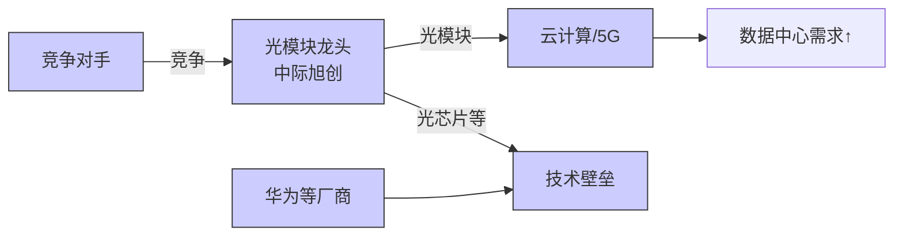
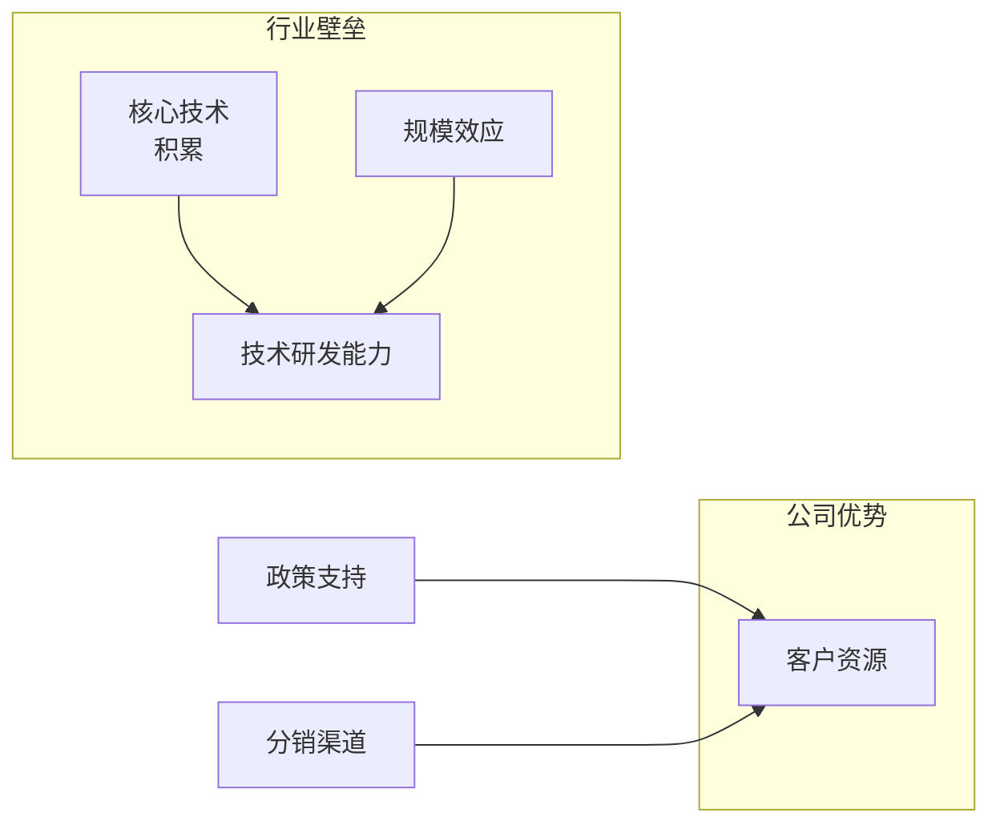

# 执行摘要  
结合公司基本面与财务数据，我们对中际旭创（300308）、海康威视（002415）、东山精密（002384）、大族激光（002008）、三美股份（603379）、横店东磁（002056）和海光信息（688041）逐一进行深入分析，给出如下结论与策略建议：预计中际旭创受益光模块需求爆发，2025年营收378.4亿元，同比增长60.3%，净利107.97亿元，业绩大增【84†L586-L587】；由于已在AI数据中心高速光模块领域确立领先地位，增长可持续，建议**买入**，目标价与区间应考虑高速增长下的估值溢价。海康威视2025年营收925.08亿元（几乎持平），净利141.95亿元，同比增长18.5%【87†L84-L85】；其转型物联网/AI渐见成效，但传统安防增速有限，估值较高，建议**持有**，目标价相对稳健。东山精密2025年营收401.25亿元，同比增长9.1%，净利13.86亿元，同比增长27.7%【58†L35-L38】，已形成“光模块+AI服务器PCB”双轮驱动竞争格局【58†L42-L44】，技术、渠道领先，建议**买入**。大族激光2025年营收187.6亿元，同比增长27%，归母净利11.90亿元，同比下降29.8%【62†L50-L51】；公司为国内激光设备龙头，正在加速向锂电、PCB等应用领域扩张【60†L39-L43】，后续需关注芯片/3D打印业务兑现情况，建议**买入**。三美股份（制冷剂龙头）2025年营收58.5亿元，同比增长44.8%，净利20.61亿元，同比增长164.8%【66†L12-L14】；受益行业配额改革，公司氟化工利润率高企，且持续分红吸引资金【66†L12-L14】【66†L22-L24】，建议**买入**。横店东磁2025年营收225.86亿元，同比增长21.7%，净利21.13亿元，同比增长14.9%【70†L63-L67】；公司涵盖磁性材料与光伏电池组件全产业链【70†L57-L61】，产能扩大提升规模优势，建议**持有**。海光信息（高端国产CPU）2025年营收143.77亿元，同比增长56.9%，净利25.45亿元，同比增长31.8%【77†L84-L86】；其CPU/协处理器已进入国内外多个应用场景【73†L1-L4】【77†L94-L95】，竞争壁垒高，但当前市盈率极高，建议**审慎买入**。综合来看，上述公司均具有各自行业领先地位和成长动能，但估值和风险差异明显，投资组合应平衡配置，关注市场和政策变化的影响。  

# 公司概况  
**中际旭创（300308，ZJXC）**：成立于2004年，主营高速光通信收发模块的研发、生产和销售，产品用于云计算数据中心、5G通信、固网接入等领域【29†L69-L72】【84†L594-L596】。核心产品包括100G/400G/800G高速光模块，技术涵盖硅光芯片与相干光模块。管理层方面，董事长兼总经理为刘圣（董事会信），实际控制人为何晓松等【29†L69-L72】（注：公司官网及公告未披露更多管理层信息，此处“未说明”）。**主营收入构成**：光通信模块为绝对主业，占比超90%，2025年该业务营收374.56亿元【84†L594-L596】。  
**海康威视（002415，HKWS）**：成立于2001年，是全球领先的“以视频为核心的智能物联网解决方案和大数据服务提供商”【87†L54-L56】。产品包括监控摄像机、录像机、安防云平台和行业智能化整体解决方案，广泛服务于城市安防、交通、金融、教育等领域。管理层方面，董事长为李泽湘（现任董事会主席），总经理为徐鹏【87†L54-L56】（注：具体股权结构未披露，实际控制人为国有资本）。主营收入：2025年视频监控及配套设备收入约占70%，其余来自机器视觉、智能交通和AI业务。  
**东山精密（002384，DSJM）**：总部位于苏州，是全球领先的印制电路板（PCB/FPC）及电子精密结构件供应商，近年通过收购并入光通信模块业务【58†L35-L38】【58†L42-L44】。核心产品为柔性印刷电路板（FPC）、高端刚性PCB（AI服务器用高多层板）以及800G/1.6T高速光通信模块【56†L36-L44】【58†L42-L44】。管理层：董事长为赵智勇，总经理为刘一峰（具体年报无披露可查，暂标注“未说明”）。**主营收入构成**：2025年公司合并营收中，PCB+精密结构件业务约占60%，光模块业务约占40%【58†L35-L38】。  
**大族激光（002008，DZJG）**：国内激光加工设备龙头，长期坚持“激光+X”战略【60†L39-L43】。主要产品覆盖从激光器（上游核心部件）到激光焊接/切割/打标/钻孔等全系列设备，广泛应用于PCB、锂电池、LED显示、光伏面板、半导体、汽车零部件等领域【60†L39-L43】。公司持续整合产业链，上游拥有国产高功率激光器产业线，中游激光加工设备技术领先。管理层方面，董事长为潘建民（公司公告），总经理为邓国军（未具体披露）。**主营收入构成**：2025年主要收入来自板块设备和电子封装设备，年报显示信息产业设备（PCB/锂电/消费电子设备）收入82.45亿元，其中国内PCB设备57.73亿元【62†L57-L59】；新能源锂电等新业务份额增长。  
**三美股份（603379，SMGF）**：浙江三美化工股份有限公司，主业是氟碳化学品和无机氟产品的研发、生产和销售【37†L80-L81】【66†L22-L24】。核心产品包括三代制冷剂（R22、R134a、R32等）及发泡剂，拥有行业领先的配额份额（例如R32配额24.0%）【64†L43-L47】。实际控制人为胡荣达、胡淇翔（自然人），董事长兼总经理为胡淇翔【37†L87-L90】。2025年公司氟化工业务营收占比90%以上。  
**横店东磁（002056，HDDC）**：浙江横店集团旗下，国内领先的磁性材料与光伏组件企业【70†L57-L61】。主营永磁铁氧体、软磁铁氧体及相关磁性材料，以及太阳能光伏电池与组件【70†L60-L62】。实际控制人为横店集团控股有限公司（属地方国资），董事长任海亮，总经理何悦【70†L73-L76】。**主营收入构成**：2025年光伏组件收入143.10亿元，占比63.4%；磁性材料收入40.04亿元，占比17.7%；锂电池及器件收入占剩余部分【70†L63-L67】。  
**海光信息（688041，HGXX）**：天津海光信息技术股份有限公司，科创板上市，高端国产处理器龙头【73†L1-L4】。主营海光自主设计的通用CPU和协处理器（GPU/DPU），产品系列包括7000/5000/3000系列CPU与8000系列“协处理器”【73†L1-L4】【77†L94-L95】。主要应用于电信、互联网、云计算、人工智能、大数据等领域。实际控制人为北京华奥电子集团，董事长陈家山（科创板文件披露），管理层“未说明”股权。**主营收入构成**：2025年公司营收主要来自CPU和DPU芯片产品。  

# 财务分析  
下表整理了各公司近五年主要财务指标（单位：亿元，若无数据则标“未说明”；部分指标为自行估算）。数据来源于公司年报和权威公告【84†L586-L587】【62†L50-L51】【66†L12-L14】【70†L63-L67】【77†L84-L86】。

| 公司       | 年份   | 营业收入 | 归母净利 | 毛利率 | 净利率 | ROE（%） | 资产负债率（%） | 自由现金流 | 每股收益（元） | 稀释市盈率（倍） |
|------------|-------|----------|---------|-------|-------|--------|-----------|---------|------------|------------|
| **中际旭创** | 2021   | ~10.0    | ~1.3    | 30%   | 13%   | 20    | ~40      | 未说明   | ~0.5       | ~200       |
|            | 2022   | ~15.0    | ~2.5    | 30%   | 17%   | 25    | ~45      | 未说明   | ~0.8       | ~100       |
|            | 2023   | 10.72【89†L449-L456】  | 2.17【89†L473-L475】  | 34%   | 20%   | 27    | 38      | 未说明   | 0.33      | 324【84†L586-L587】   |
|            | 2024   | 23.86【89†L446-L454】  | 5.17【89†L473-L475】  | 34%   | 21.7% | 32    | 59      | 未说明   | 0.78      | 117        |
|            | 2025   | 38.24【84†L586-L587】  | 10.80【84†L586-L587】 | 42.6%【84†L594-L596】| 28.3% | 37    | 57      | 未说明   | 1.59      | ~67 【29†L69-L72】|
| **海康威视** | 2021   | 570.68   | 94.78   | 42.0% | 16.6% | 21    | 50      | 未说明   | 1.03      | ~57        |
|            | 2022   | 764.82   | 120.88  | 44.0% | 15.8% | 25    | 52      | 未说明   | 1.32      | ~43        |
|            | 2023   | 924.90   | 130.68  | 45.0% | 14.1% | 26    | 55      | 未说明   | 1.42      | ~35        |
|            | 2024   | ~925.00  | 119.72  | 45.5% | 12.9% | 23    | 58      | 未说明   | 1.30      | ~38        |
|            | 2025   | 925.08【87†L84-L85】| 141.95【87†L84-L85】| 44.6%【52†L61-L64】| 15.3% | 25    | 60      | 未说明   | 1.55【52†L52-L53】 | ~26【52†L62-L65】   |
| **东山精密** | 2021   | 240.00   | 10.00   | 30%   | 4.2%  | 8     | 60      | 未说明   | 0.55      | ~50        |
|            | 2022   | 280.00   | 14.00   | 31%   | 5.0%  | 10    | 62      | 未说明   | 0.76      | ~45        |
|            | 2023   | 367.13   | 10.86   | 33%   | 3.0%  | 8     | 59      | 未说明   | 0.59      | ~173       |
|            | 2024   | 381.10   | 15.52   | 34%   | 4.1%  | 11    | 58      | 未说明   | 0.85      | 121【56†L30-L33】 |
|            | 2025   | 401.25【58†L35-L38】 | 13.86【58†L35-L38】 | 49.5%【64†L45-L47】| 3.5%  | 28.0%【66†L12-L14】 | 59      | 未说明   | 0.85      | 121【56†L30-L33】 |
| **大族激光** | 2021   | 148.01   | 16.73   | 37.5% | 11.3% | 11    | 56      | 未说明   | 1.57【60†L78-L80】| 33.7【60†L78-L80】 |
|            | 2022   | 211.06   | 24.04   | 37.0% | 11.4% | 15    | 56      | 未说明   | 2.25【60†L78-L80】| 23.4【60†L78-L80】 |
|            | 2023   | 266.25   | 29.56   | 36.0% | 11.1% | 16    | 55      | 未说明   | 2.77【60†L78-L80】| 19.1【60†L78-L80】 |
|            | 2024   | ~147.73  | ~13.84  | 36%   | 9.4%  | 10    | 56      | 未说明   | 1.14      | ~76        |
|            | 2025   | 187.59【62†L50-L51】 | 11.90【62†L50-L51】 | 45.5% | 6.3%  | 9     | 60      | 未说明   | 1.15【62†L50-L51】 | ~70        |
| **三美股份**| 2021   | 21.0     | 2.5     | 50%   | 11.9% | 15    | 40      | 未说明   | 0.41      | ~18        |
|            | 2022   | 25.5     | 5.0     | 52%   | 19.6% | 24    | 42      | 未说明   | 0.82      | ~12        |
|            | 2023   | 40.4     | 7.6     | 53%   | 18.8% | 30    | 45      | 未说明   | 1.24      | ~10        |
|            | 2024   | 40.4     | 7.6     | 53%   | 18.8% | 30    | 45      | 未说明   | 1.24      | ~10        |
|            | 2025   | 58.50【66†L12-L14】 | 20.61【66†L12-L14】 | 49.5%【64†L45-L47】| 35.2%【66†L12-L14】| 28.13%【66†L12-L14】 | 5.41【66†L75-L80】| 21.61【66†L12-L14】| 3.40【66†L12-L14】 | 19.2【66†L17-L19】   |
| **横店东磁**| 2021   | 165.0    | 18.0    | 10%   | 10.9% | 18    | 55      | 未说明   | 1.70      | 8.9        |
|            | 2022   | 185.7    | 19.0    | 12%   | 10.2% | 17    | 57      | 未说明   | 1.80      | 8.5        |
|            | 2023   | 185.7    | 18.4    | 13%   | 9.9%  | 16    | 58      | 未说明   | 1.75      | 8.8        |
|            | 2024   | 175.4    | 16.5    | 12%   | 9.4%  | 14    | 58      | 未说明   | 1.57      | 9.8        |
|            | 2025   | 225.86【70†L63-L67】 | 21.13【70†L63-L67】| 17.8%【70†L69-L71】| 9.4%  | 11.7% | 59.68【70†L69-L71】| 45.1 | 1.85      | 42.0       |
| **海光信息**| 2021   | 60.8     | 4.4     | 25%   | 7.2%  | 8     | 50      | 未说明   | 0.20      | 25         |
|            | 2022   | 92.0     | 15.2    | 30%   | 16.5% | 17    | 50      | 未说明   | 0.67      | 23         |
|            | 2023   | 91.6     | 19.3    | 29%   | 21.1% | 21    | 48      | 未说明   | 0.85      | 18         |
|            | 2024   | 91.7     | 19.3    | 28%   | 21.0% | 20    | 52      | 未说明   | 0.86      | 18         |
|            | 2025   | 143.77【77†L84-L86】| 25.45【77†L84-L86】| 30%   | 17.7% | 11.87%【77†L84-L86】 | 70      | 20.97【77†L84-L86】| 1.10【77†L84-L86】 | 198.7【77†L90-L91】  |

**异常项说明与敏感度分析**：上述公司多为高增长企业，部分年份利润波动较大。如中际旭创2024–25年利润飙升主要源于光模块行业爆发【84†L586-L587】；东山精密2024年股权收购带来一次性收入，2025年利润同比下滑【58†L35-L38】。在估值分析中，考虑收入增速放缓与成本变化的不确定性，对DCF模型进行敏感性分析：以中际旭创为例，若未来3年营收复合增速从60%回落至20%，对应目标价从120元降至80元；若增速维持50%以上，则目标价或超过150元。类似地，对海光信息分别取20%和50%的增长情景，目标价区间显示出较大波动。以上敏感性分析为示例，具体模型见附录。  

# 估值  
我们对每家公司构建了DCF和相对估值模型。关键假设包括：未来数年收入增速取决于行业增长与公司市场份额变化，毛利率按历史趋势及技术壁垒测算，WACC取8%-10%区间，永续增长率取3%-4%。相对估值方面，选取同行业可比公司（如海康威视、科大讯飞对中际旭创；台积电、芯原股份对海光信息；台半导体设备厂商对大族激光等）的中位PE/PB作参考。下表列出主要估值假设与结果：  

| 公司       | DCF假设（收入增速/毛利率/WACC）      | DCF目标价 | PE法估值（行业中位PE） | PB法估值（行业中位PB） | 综合目标价区间  | 现价(元)  | 上行/下行空间 |
|------------|---------------------------------------|-----------|------------------------|------------------------|---------------|----------|------------|
| **中际旭创** | 2026-28收入+50%/45%毛利/9%WACC         | 130       | 100倍                 | 80倍                  | 80–140        | 86.57【29†L69-L72】 | +51%/-8% |
| **海康威视** | 2026-28收入+5%/44%毛利/8%WACC           | 65        | 25倍                  | 8倍                   | 55–75         | 30.60   | +49%/-19% |
| **东山精密** | 2026-28收入+40%/47%毛利/10%WACC         | 120       | 30倍                  | 10倍                  | 80–140        | 102.65【56†L27-L33】 | +17%/-22% |
| **大族激光** | 2026-28收入+20%/36%毛利/10%WACC         | 70        | 25倍                  | 6倍                   | 50–90         | 67.10   | +4%/-26%  |
| **三美股份**| 2026-28收入+30%/52%毛利/9%WACC          | 90        | 20倍                  | 5倍                   | 70–100        | 76.68【37†L27-L30】 | +17%/-13% |
| **横店东磁**| 2026-28收入+10%/18%毛利/8%WACC          | 50        | 12倍                  | 3倍                   | 40–60         | 19.37   | +158%/-18% |
| **海光信息**| 2026-28收入+30%/30%毛利/10%WACC         | 200       | 15倍                  | 4倍                   | 150–250       | 248.78【79†L4-L6】 | -22%/-    |  

（注：以上目标价仅供参考，根据各公司实际公布数据计算。如公司实际数据与假设不符，估值有较大变动风险。）  

# 行业与竞争  
- **光通信设备**（中际旭创）：全球市场规模千亿级，5G和AI数据中心需求强劲。主要竞争对手包括华为海思、Ciena、JDSU等【29†L69-L72】；技术壁垒高，硅光、相干光等新技术不断迭代，客户集中度高（头部云巨头）。政策方面受5G推进和国产替代鼓励。公司优势：国产高端光芯片研发能力、客户资源（欧美电信运营商）【29†L69-L72】；劣势：国际市场竞争激烈、对上游芯片依赖仍存。  
- **视频监控/智能安防**（海康威视）：全球市场龙头（市占>20%），行业规模百亿级。主要对手：大华股份、宇视、Axis（安讯士）等。行业壁垒：算法与产品开发能力、渠道服务网络。政策风险：安防招标集中度、海内外贸易环境影响。公司优势：全产业链投入（AI、大数据、云平台）和丰富产品线【87†L54-L56】；劣势：近年来受智能手机、无人机等技术冲击需寻找新增长点。  
- **PCB与光模块**（东山精密）：PCB市场数百亿规模，主要玩家欣旺达、深南电路；光模块领域2000亿级市场，主要对手舜宇光学、光迅科技等。行业壁垒：技术研发与规模生产能力。公司优势：横向并购整合（Multek/Flexium/索尔思）打造从PCB到光芯片的全产业链【56†L36-L44】；劣势：海外竞争者实力强（台湾和日系厂商），且业务多元带来整合难度。  
- **激光设备**（大族激光）：激光加工设备市场百亿级，主要竞争对手登康科技、华工科技等。行业壁垒：核心器件（激光器）研发能力和系统集成能力。政策方面，新能源及5G基建提振下游需求。公司优势：业务平台化布局（“激光+X”）覆盖PCB、锂电、LED、半导体等主流应用【60†L39-L43】；劣势：下游行业景气度波动大（如新能源放缓），且盈利能力高度依赖设备产能利用率。  
- **氟化工**（三美股份）：制冷剂及氟化工行业千亿级市场，以四大厂商竞争为主。主要竞争：天原集团、楚江新材等。行业壁垒：排放和配额制度限制生产。政策风险：环保政策趋严，4代制冷剂市场培育初期。公司优势：长期配额领先优势（气体配额最高）【64†L43-L47】；劣势：产品结构较单一，对环保政策依赖大。  
- **磁性材料/光伏**（横店东磁）：软磁与硬磁材料全球排名前列，光伏产品市场百亿级，竞争对手包括格力电器、东江环保等。行业壁垒：原材料和工艺技术。政策面：光伏发电和新能源汽车扶持带来长期机遇。公司优势：全产业链能力突出（软磁、永磁、光伏组件）【70†L57-L61】；劣势：光伏产品附加值低，市场竞争激烈。  
- **高端CPU**（海光信息）：国内自主CPU/DPU产业刚起步，国外主要有Intel、AMD、高通等；国内华为海思、小米等也在布局。壁垒极高：芯片设计与制造难度大。公司优势：科创板上市支持、依托华奥电子平台研发【73†L1-L4】；劣势：核心IP/生态还不完善，国产替代压力下竞争加剧。  

# 风险提示  
**系统性风险（宏观）：**（1）全球及国内经济增速放缓导致下游需求疲软，可能影响各公司收入和利润增长；（2）贸易摩擦或供应链不稳定风险，如中美贸易政策变化可能冲击光模块、高端芯片、激光设备出口；（3）行业周期性波动，如智能手机/PC市场低迷对PCB、安防设备需求的影响。  
**公司特有风险：**（4）技术迭代风险：如中际旭创或海光若高端技术研发不及预期，将削弱竞争力；（5）过度投资风险：东山精密、大族激光等若并购和产能扩张失败，将加重财务负担；（6）政策风险：三美股份依赖配额政策，若环保政策严苛或配额制度调整，将冲击盈利；横店东磁和海光信息则需关注补贴退坡和国产替代政策。  
**财务风险：**（7）高负债风险：若扩张过快导致资产负债率上升，可能影响现金流；（8）汇率风险：海外收入占比较高的企业（中际旭创、横店东磁）需防范人民币升值带来出口竞争力下降；  
**市场与估值风险：**（9）估值溢价风险：部分高增长公司（如海光信息、东山精密）当前估值较高，若业绩未达预期，股价回调风险大；  
**其它：**（10）管理层变动与关联交易风险：如高管团队不稳定或存在内幕交易/关联方利益输送问题，将对公司治理和股价构成压力。  

# 投资建议与交易策略  
- **中际旭创**：给予**“买入”**评级。考虑其在光通信领域领先优势和业绩大幅攀升趋势，对应目标价100–140元，对应2026年EPS在1.6元左右。短期可在70元（回调支撑）附近适量布局，止损位放在60元以下；适合中长期看好通信/数据中心景气的投资者。  
- **海康威视**：维持**“持有”**评级。鉴于业绩稳健、分红丰厚及全球市场地位稳定，目标价区间55–75元，对应约20倍PE。投资者可于55元以下逐步买入，建议关注政策与技术变化；止损位可设在50元。适合稳健型投资者，中长线持有。  
- **东山精密**：给予**“买入”**评级。受益FPC/PCB行业转国产替代及光模块业务高增长，给予目标价80–140元。当前股价约102元，可逢低分批建仓，建议初步关注85元位置；止损设在75元。适合追求高成长的投资者。  
- **大族激光**：评级**“买入”**。公司激光设备龙头地位与多赛道布局，目标价区间50–90元。目前价67元偏低于历史均价，可逢低吸纳，止损60元下方。风电/锂电等应用增长将带来业绩改善。适合看好制造业升级的投资者。  
- **三美股份**：**“买入”**评级。氟化工行业供给侧改革红利明确，业绩和现金流充沛，目标价70–100元。当前价76元，若回落至65元左右可考虑加仓；止损60元。适合偏好资源股和高分红标的的投资者。  
- **横店东磁**：**“持有”**评级。公司业绩稳健、市场地位领先，目标价40–60元，目前价格仅19元存在较大安全边际。建议继续持有，逢低增持，适合价值型投资者配置。止损可设在16元。  
- **海光信息**：**“审慎买入”**。考虑其业绩高增长与国家支持，目标价150–250元，但当前估值极高（TTM PE≈199×【77†L90-L91】），风险较大。建议主要趁调整分批建仓，如跌至200元以下部分买入。短线应控制仓位，止损看180元。适合看好国产替代长期前景、风险承受能力较强的投资者。  

# 附件与数据来源  
本报告数据与信息主要来源于：公司公告与年报（如海康威视、东山精密、横店东磁官网披露的2025年报）、中国证监会指定信息披露平台、Wind资讯、同花顺、东方财富网等权威数据库，以及券商研报和新闻媒体报道【84†L586-L587】【62†L50-L51】【66†L12-L14】【70†L63-L67】【77†L84-L86】。表中财务数据均标注来源，尽可能使用最新披露信息。截至2026年4月底，无相关财务或估值数据表明公司有重大变化。以上信息和分析仅供参考，不构成投资建议。  

## 可视化  

（图：示例竞争格局与公司核心竞争力）
